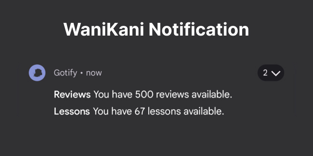

# wanikaninotify

> **Please note.**
>
> This repository/project is maintenance mode, there shouldn't be any further development to this project, as it simply works!

This is a script for [WaniKani](https://www.wanikani.com/) to send notifications about your reviews and lessons hourly, should more than zero.

The following tech is used.

* [WaniKani](https://www.wanikani.com/) (for gathering lessons/reviews count).
* [Gotify](https://gotify.net/) (for sending notifications to your phone).
* [Docker](https://www.docker.com/) (for easy deployment).



## Supported Architectures

The architectures supported by this image are `amd64`, `arm/v7` and. `arm64`

## Version tags

This image provides a singular version, built from the `main` branch.

## Usage

Here are some example snippets to help you get started creating a container.

docker-compose (recommended).

```yaml
# docker-compose.yml
version: "3"
services:
  waninotify:
    image: ghcr.io/jakehwll/wanikaninotify
    container_name: wanikaninotify
    environment:
      - WANIKANI_API_TOKEN= # https://www.wanikani.com/settings/personal_access_tokens
      - GOTIFY_API_URI= # https://gotify.domain.com
      - GOTIFY_API_TOKEN= # https://gotify.domain.com/#/applications
    restart: unless-stopped # optional.
```

```sh
docker-compose up -d
```

command.

```sh
# environment variables
export WANIKANI_API_TOKEN=""
export GOTIFY_API_URI=""
export GOTIFY_API_TOKEN=""
# the magic.
docker run \
  --name="wanikaninotify" \
  -e WANIKANI_API_TOKEN=${WANIKANI_API_TOKEN} \
  -e GOTIFY_API_URI=${GOTIFY_API_URI} \
  -e GOTIFY_API_TOKEN=${GOTIFY_API_TOKEN} \
  --restart unless-stopped \
  ghcr.io/jakehwll/wanikaninotify
```

## Parameters

| Parameter                                   | Function                                                                                                      |
| ------------------------------------------- | ------------------------------------------------------------------------------------------------------------- |
| -e WANIKANI_API_TOKEN=""                    | The token from your [Wanikani Account for the API](https://www.wanikani.com/settings/personal_access_tokens). |
| -e GOTIFY_API_URI=""                        | The Base URL from your Gotify Instance.                                                                       |
| -e GOTIFY_API_TOKEN=""                      | The Application Token from your Gotify Instance                                                               |
